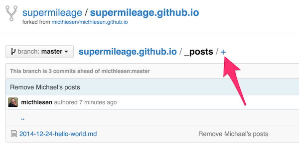
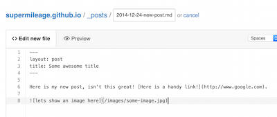

# supermileage.github.io

## Writing a New Post
This may look intimidating, but in reality it's quite simple! Just follow these steps:
- Make sure you are a collaborator for the GitHub project. Just ask someone on the admin team to help you with this.
- Navigate [here](https://github.com/supermileage/supermileage.github.io/tree/master/_posts) and click the `+` sign to create a new file. 
- Name your file according to the [Jekyll post naming format](http://jekyllrb.com/docs/posts/#creating-post-files). The basic naming format is `YEAR-MONTH-DAY-title.md`. The title can be multiple words separated by dashes. Use leading zeros in the date when appropriate!
- Always add the following snippet to the top of your post, where title is the title of your post (doesn't necessarily have to match the one in the filename):
```markdown
---
layout: post
title: Some awesome title
---
```
- Leave an empty line after this and start writing your post! We are using Markdown to format our posts, which might seem a bit intimidating but it's actually very simple. You can check [this reference](https://daringfireball.net/projects/markdown/basics) as a guide, but it's probably easier to just [look at the other posts](https://github.com/supermileage/supermileage.github.io/tree/master/_posts) to get a feel for how they work.
- You can upload images to the `images/` folder and reference them in your post like so: ``. The ideal image width is 1140 pixels.
- In the end it should look something like this: 
- Now just click "Commit new file". That's it!

## Installation

### Dependencies
- [npm](https://www.npmjs.com/)
- [Ruby](https://www.ruby-lang.org/)
- [RubyGems](https://rubygems.org/)
- [Bundler](http://bundler.io/) (`$ gem install bundler`)

### More Dependencies
- `$ npm install`
- `$ bower install`
- `$ bundle install`

## Running the Project
- `$ grunt`

You can now browse to [localhost:8000](http://localhost:8000/) to view the site. There's no need to restart grunt after you make changes, it will update automatically.

## Building the Project
- `$ grunt build`

If you're not running the `$ grunt` command which watches for changes, run this before each commit. It will compress and clean the CSS file (`build/style.css`).
